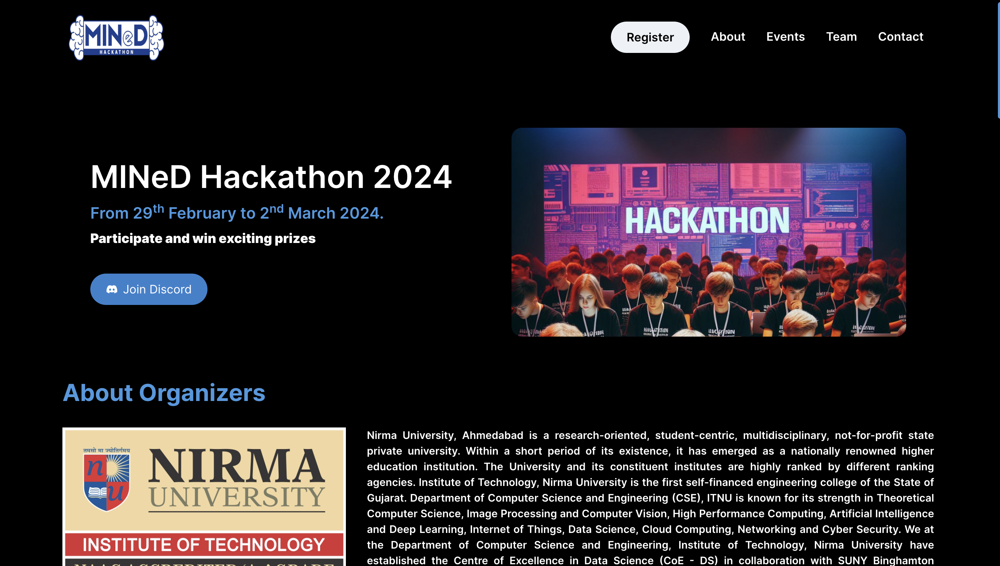
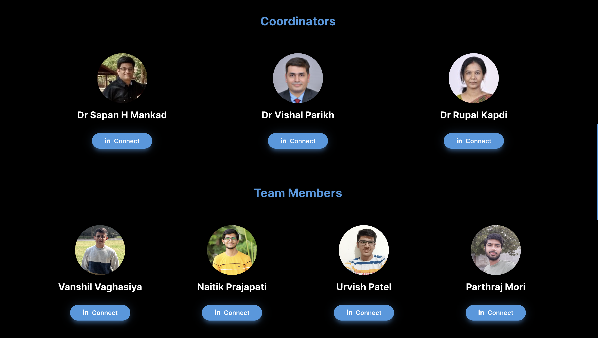
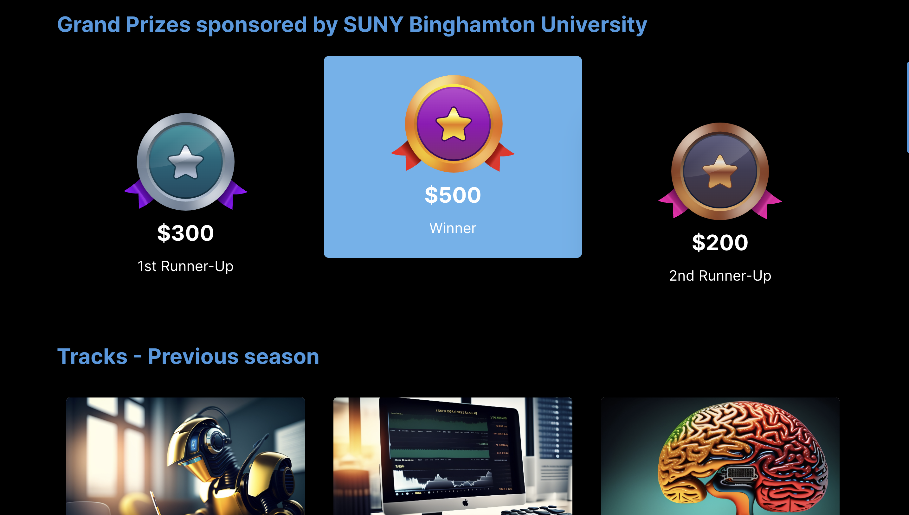
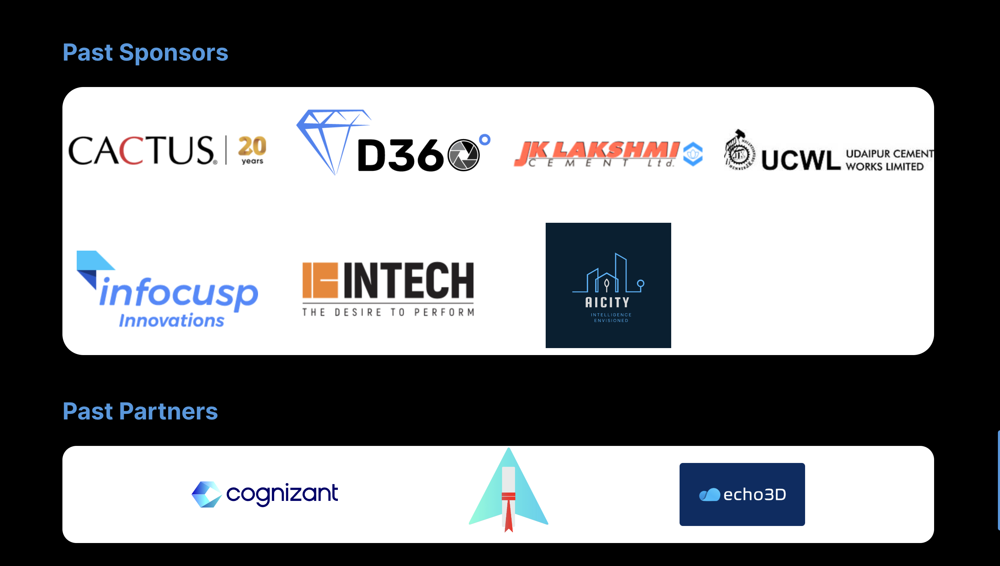

# MINeD'24 Hackathon

It is a National level online hackathon organised by the CSE Department Nirma University, in collaboration with Computer Science - Binghamton University, USA. The hackathon will allow students to work on industry-level problems in the domains of Smart Healthcare, Applied Machine Learning for Manufacturing Industry, AI & Big Data, Computer Vision and Deep Learning, Internet Of Things, Natural Language Processing etc.

## Demo

Live Link : https://www.mined2024.tech/


## Screenshots






## Run Locally

Clone the project

```bash
  git clone https://github.com/VanshilPatel/MINeD-24
```

Go to the project directory

```bash
  cd MINeD-24
```

Install dependencies

```bash
  npm install
```

Start the server

```bash
  npm run dev
```


 NextJS, ChakraUI


